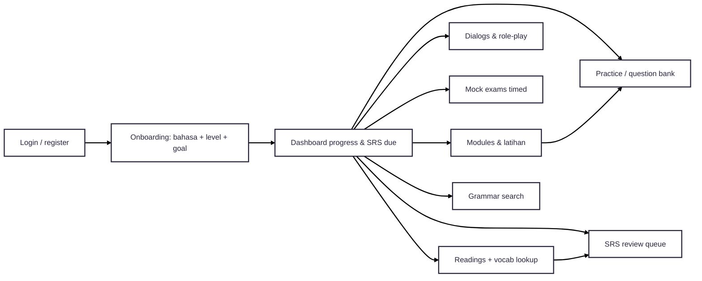

# Bhasara — Alur belajar (hub & spoke)

```mermaid
---
config:
  theme: redux
---
flowchart LR
  AUTH[Login / register]
  ONB[Onboarding: bahasa + level + goal]
  HOME[Dashboard progress & SRS due]
  AUTH --> ONB --> HOME
  HOME --> MOD[Modules & latihan]
  HOME --> QZ[Practice / question bank]
  HOME --> DIA[Dialogs & role-play]
  HOME --> SRS[SRS review queue]
  HOME --> MOCK[Mock exams timed]
  HOME --> READ[Readings + vocab lookup]
  HOME --> GR[Grammar search]
  MOD --> QZ
  READ --> SRS
```
