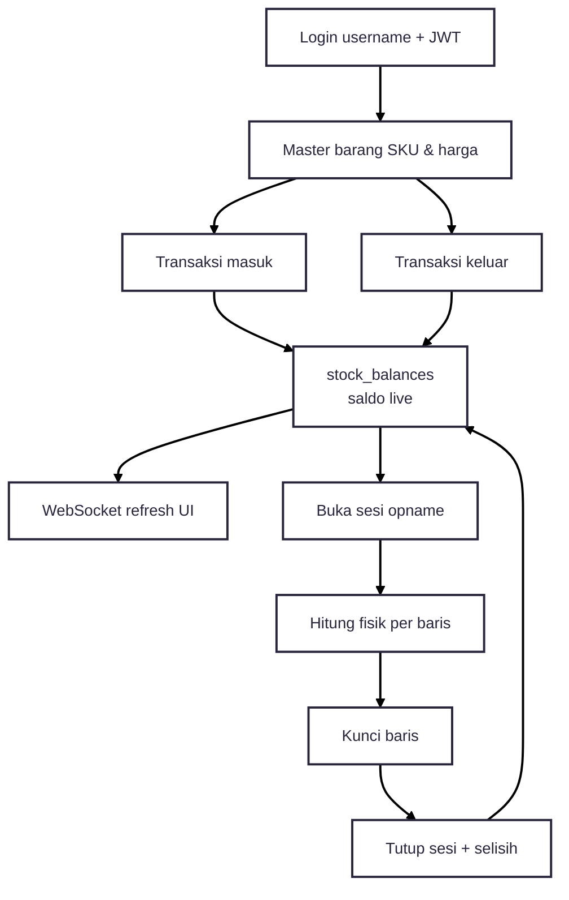

# Stock Opname — Saldo warung Arbian

```mermaid
---
config:
  theme: redux
---
flowchart TB
  LOGIN[Login username + JWT]
  MASTER[Master barang SKU & harga]
  IN[Transaksi masuk]
  OUT[Transaksi keluar]
  BAL["stock_balances<br/>saldo live"]
  WS[WebSocket refresh UI]
  OPNAME[Buka sesi opname]
  HITUNG[Hitung fisik per baris]
  LOCK[Kunci baris]
  CLOSE[Tutup sesi + selisih]

  LOGIN --> MASTER
  MASTER --> IN
  MASTER --> OUT
  IN --> BAL
  OUT --> BAL
  BAL --> WS
  BAL --> OPNAME
  OPNAME --> HITUNG --> LOCK --> CLOSE
  CLOSE --> BAL
```
