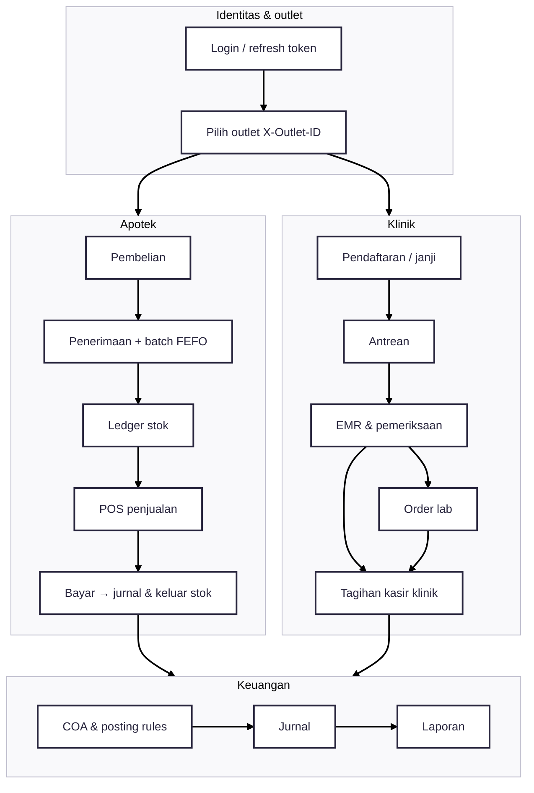

# VMedic — Apotek + klinik + keuangan

```mermaid
---
config:
  theme: redux
---
flowchart TB
  subgraph TENANT["Identitas & outlet"]
    LOGIN[Login / refresh token]
    OUTLET[Pilih outlet X-Outlet-ID]
    LOGIN --> OUTLET
  end

  subgraph PHARM["Apotek"]
    PO[Pembelian]
    RECV[Penerimaan + batch FEFO]
    STOCK[Ledger stok]
    POS[POS penjualan]
    PAY[Bayar → jurnal & keluar stok]
    PO --> RECV --> STOCK
    STOCK --> POS --> PAY
  end

  subgraph CLINIC["Klinik"]
    REG[Pendaftaran / janji]
    QUEUE[Antrean]
    EXAM[EMR & pemeriksaan]
    LAB[Order lab]
    BILL[Tagihan kasir klinik]
    REG --> QUEUE --> EXAM
    EXAM --> LAB
    EXAM --> BILL
    LAB --> BILL
  end

  subgraph FIN["Keuangan"]
    COA[COA & posting rules]
    JRNL[Jurnal]
    RPT[Laporan]
    COA --> JRNL --> RPT
  end

  OUTLET --> PHARM
  OUTLET --> CLINIC
  PAY --> FIN
  BILL --> FIN
```
